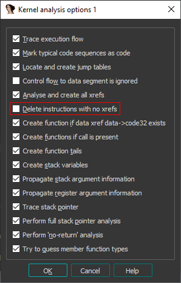

# How to setup IDA to work with mGBA

1. Replace `cfg/arm-core.xml` in the IDA directory with the `arm-core.xml` file provided in this repository

2. Load the ELF/ROM in IDA with the following options:

 - In _Processor options_ -> _Edit ARM architecture options_, change the options to reflect the values below

     

 - From _Kernel options 1_, uncheck the box corresponding to _Delete instructions with no xrefs_

     

3. Check _Use function bounds_ if asked about DWARF debug information

     

4. From the debug toolbar dropdown menu, select _Remote GDB debugger_

     

5. In _Debugger_ -> _Process options_ set the hostname to `localhost` and the port to `2345`

     

6. Recreate the GBA memory layout in the Segments window [Shift+F7] (optional if you loaded an ELF file)